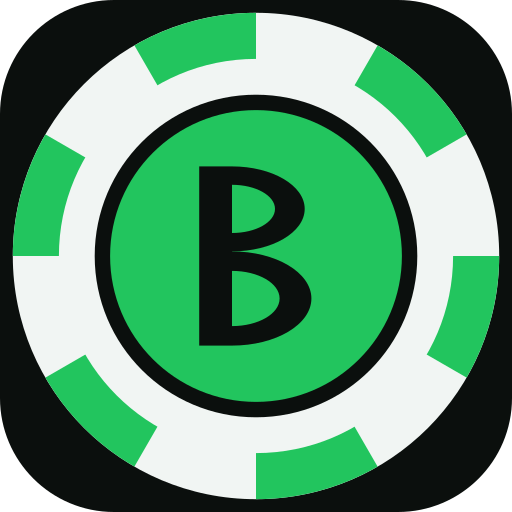
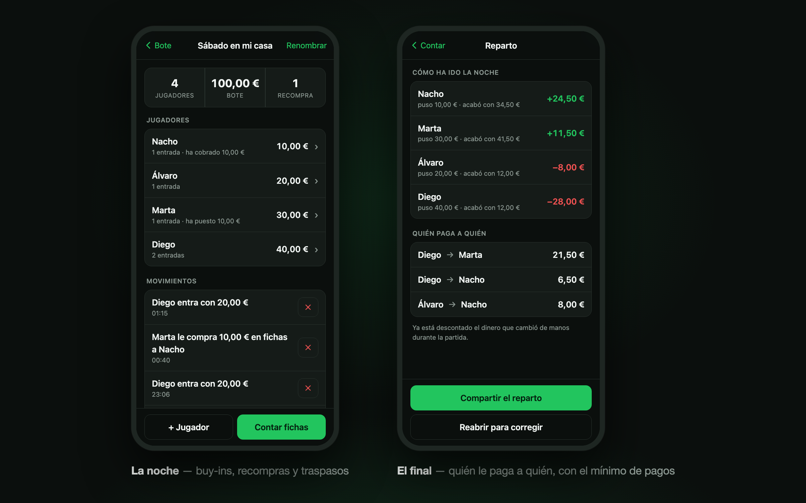

<div align="center">



# Bote

**Cuenta las fichas de la partida y dice quién le paga a quién.**

[**Abrir la app →**](https://bote.nachosanbenito.com)

[](package.json)
[](test)
[](sw.js)
[](LICENSE)



</div>

Contador de fichas y reparto de dinero para partidas de póker en casa. Un Tricount
adaptado al póker: se apuntan los buy-ins durante la noche, al final se cuentan las
fichas de cada uno y la app dice **quién le paga a quién**, con el mínimo de pagos.

Es una web que, añadida a la pantalla de inicio desde Safari, se abre como una app:
pantalla completa, icono propio y funcionando sin cobertura.

## Cómo funciona la cuenta

Todo el dinero se lleva en **céntimos enteros**, nunca en euros con decimales flotantes.

Una partida es una lista de movimientos de tres tipos:

| Movimiento | Fichas | Dinero |
|---|---|---|
| `buyin` — entrada o recompra, a fiar | recibe fichas nuevas | nada todavía |
| `compra_a_jugador` — le compra fichas a otro | pasan del vendedor al comprador | el comprador le paga al vendedor |
| `pago` — dinero suelto entre dos | nada | de uno a otro |

El segundo es la clave: **comprarle fichas a otro no es un buy-in**. No entran fichas
nuevas en la mesa, solo cambian de dueño. Apuntarlo como buy-in inflaría las fichas en
juego y el cuadre final no cerraría nunca.

Con eso, por jugador:

```
base       = buy-ins + fichas compradas a otros − fichas vendidas a otros
final      = fichas contadas × valor de cada color
resultado  = final − base                      ← el P&L de la noche. Suma 0 en la mesa.
pendiente  = resultado − (cobrado − pagado)    ← + cobra, − paga. Suma 0.
```

De `pendiente` sale la lista de pagos con el algoritmo voraz de siempre (el que más debe
le paga al que más tiene que cobrar): como mucho N−1 transferencias.

Antes de repartir, la app comprueba lo que nadie comprueba a mano:

- que las fichas contadas valgan justo lo que se ha metido en la mesa, y si no,
  **dónde está el error**: «faltan 3 fichas de las negras», o «¿falta apuntar una
  recompra de 20 €?» cuando el descuadre es un múltiplo del buy-in;
- que no se hayan contado más fichas de un color de las que hay en la caja.

Si la cuenta no cuadra, no se propone reparto: un reparto sobre una cuenta descuadrada
sería mentira.

**Lo que no hace:** llevar el stack de cada jugador en tiempo real. Las fichas se mueven
en cada mano y apuntarlo sería imposible. Se apuntan buy-ins y traspasos, y se cuenta al
final. Quien se levanta a media noche cuenta sus fichas en ese momento y queda cerrado.

## Uso

En el móvil: abrir la web, **Compartir → «Añadir a pantalla de inicio»**. A partir de ahí
se abre como una app y funciona sin conexión. Los datos se guardan en el propio móvil
(`localStorage`), no hay servidor ni cuenta.

En el Mac, para desarrollar:

```bash
./run.command
```

## Estructura

```
index.html            una sola página, 5 vistas
css/app.css           tema oscuro, tipografía grande
js/motor.js           el cálculo. Cero DOM, cero localStorage
js/fichas.js          validación del set y reparto inicial sugerido
js/estado.js          modelo y persistencia en localStorage
js/ui.js              pintado y eventos
sw.js                 service worker: cachea todo para el modo avión
tools/iconos.py       genera los iconos PNG (solo stdlib)
test/                 node --test
```

`motor.js` y `fichas.js` no importan nada: por eso el cálculo se puede probar entero
desde node, sin navegador.

## Tests

```bash
npm test
```

39 tests sobre el motor, el reparto de fichas y la persistencia: recompras, compras entre
jugadores, jugadores que se retiran antes, conteos que no cuadran, y la comprobación de
que los saldos siempre suman cero y nunca hacen falta más de N−1 pagos.

## Iconos

```bash
python3 tools/iconos.py
```

## Publicar

Es una web estática sin dependencias ni build: vale cualquier hosting. En GitHub Pages,
subir el repo y activar Pages sobre la rama principal.

Al publicar una versión nueva hay que subir `VERSION` en `sw.js`, o los móviles que ya la
tengan instalada seguirán abriendo la vieja desde su caché.
